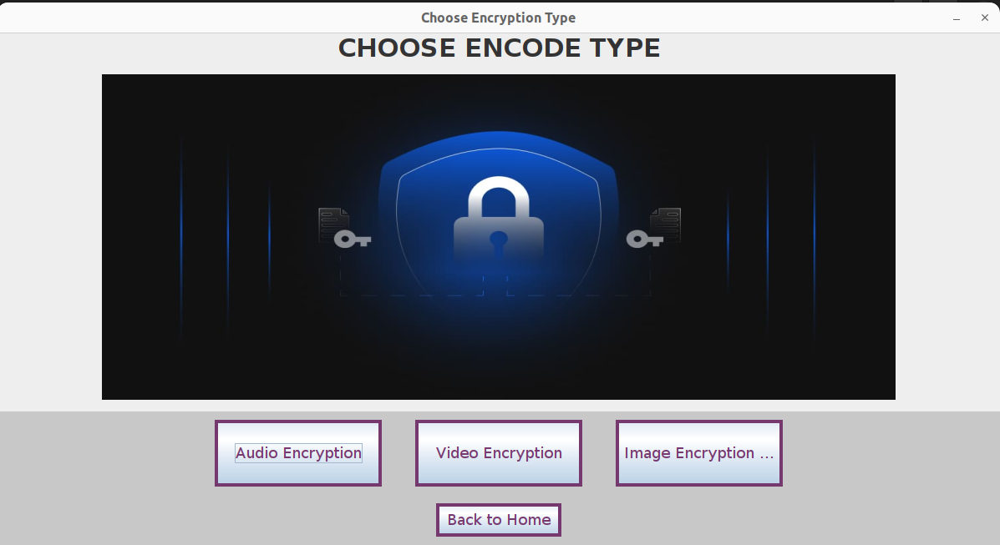
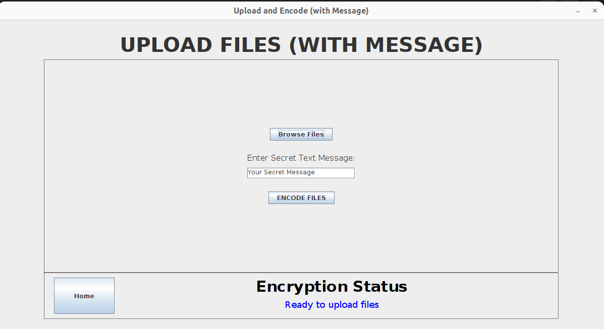
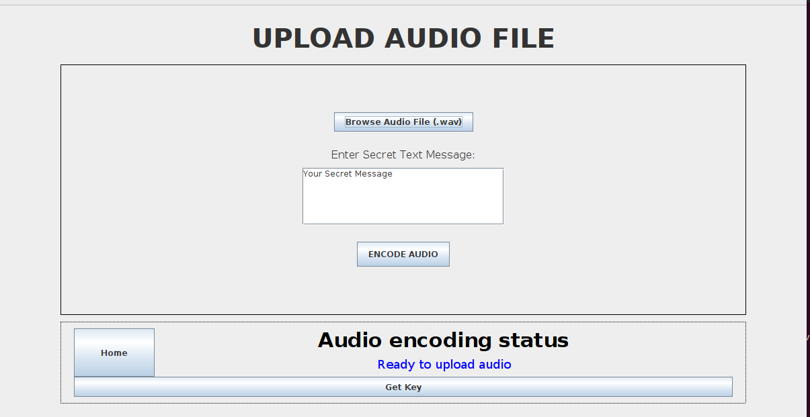
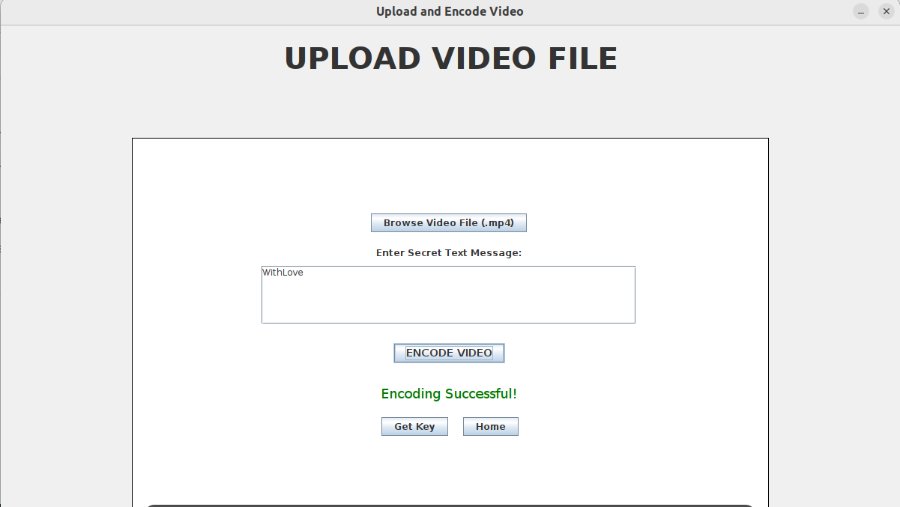
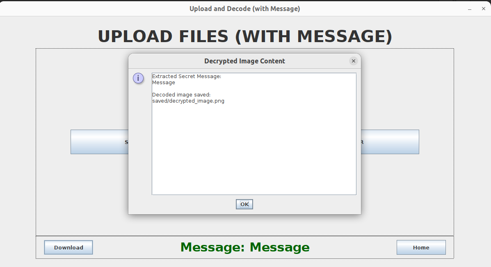
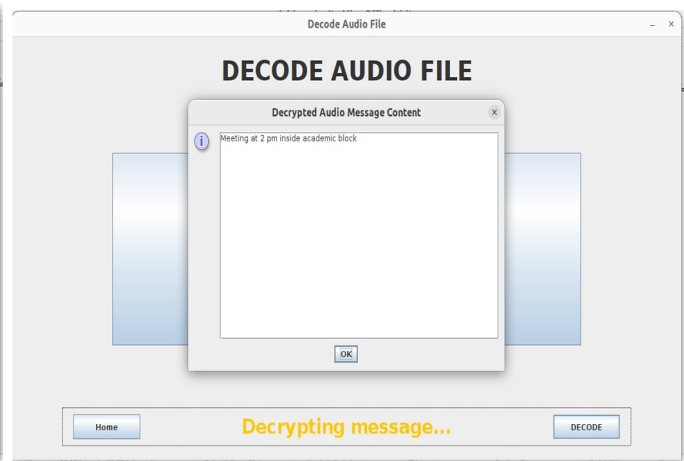
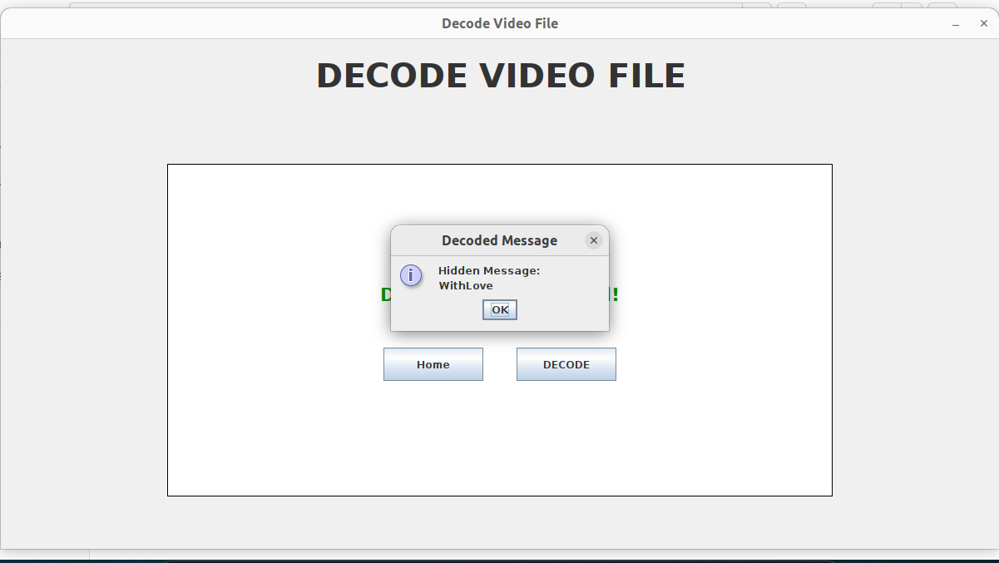

# 🔒 Digital Stego-Cryptography using Java

A Java Swing desktop application that combines **Cryptography** and **Steganography** to securely hide confidential messages inside **images, audio, and video files**. The application integrates **AES encryption**, **RSA key exchange**, and **LSB (Least Significant Bit) steganography** to provide secure data transmission while maintaining the quality of the carrier media.

---

## 📌 Features

- 🔐 AES-based message encryption before embedding
- 🖼️ Image steganography using LSB
- 🎵 Audio steganography for WAV files
- 🎥 Video steganography for MP4 files
- 🔑 RSA (2048-bit) key pair generation
- 📱 QR Code-based secure session key sharing
- 🖥️ Java Swing graphical user interface
- 📂 Drag-and-drop file upload support
- 🔓 Secure encoding and decoding workflows

---

## 🛠️ Technologies Used

| Technology | Purpose |
|------------|---------|
| Java | Core Programming |
| Java Swing | Desktop GUI |
| AES | Message Encryption |
| RSA (2048-bit) | Secure Key Exchange |
| LSB Steganography | Data Hiding |
| ZXing | QR Code Generation |
| JCodec | Video Processing |
| Java Cryptography API | Cryptographic Operations |

---

## 🏗️ System Architecture

```
                    Secret Message
                           │
                           ▼
                 AES Encryption
                           │
                           ▼
          Select Image / Audio / Video
                           │
                           ▼
              LSB Steganography
                           │
                           ▼
                 Encoded Media File
                           │
             -------------------------
                           │
                    Receiver Side
                           │
                           ▼
             Extract Hidden Message
                           │
                           ▼
                 AES Decryption
                           │
                           ▼
                  Original Message
```

---

## 📸 Application Screenshots

### Home Screen


### Image Encryption


### Audio Encryption


### Video Encryption


### Image Decryption


### Audio Decryption


### Video Decryption


---

## 🚀 How to Run

### Clone Repository

```bash
git clone https://github.com/ramyabathala068/Digital-steganography.git
```

### Open Project

Import the project into NetBeans or Eclipse.

### Install Libraries

- ZXing
- JCodec

### Run

Execute

```
Home.java
```

---

## 📂 Project Modules

- Image Steganography
- Audio Steganography
- Video Steganography
- AES Encryption
- RSA Key Generation
- QR Code Generation
- Encoding Module
- Decoding Module

---

## 📈 Key Highlights

- Supports **3 different media formats**
- Uses **AES encryption** for message confidentiality
- Implements **2048-bit RSA** for secure key exchange
- Integrates **QR code-based session key sharing** for image module
- Desktop application developed using **Java Swing**

---

## 🔮 Future Enhancements

- PDF Steganography
- Cloud Storage Integration
- Password Authentication
- Performance Optimization
- Batch Media Processing

---

## 👩‍💻 Author

**Ramya Bathala**

- GitHub: https://github.com/ramyabathala068
- Email: ramyabathala068@gmail.com
